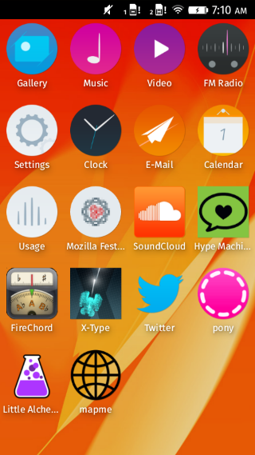
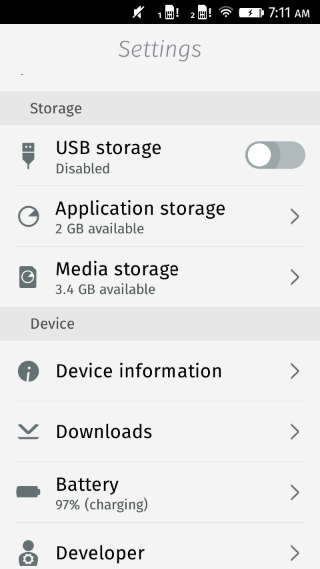
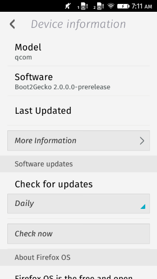
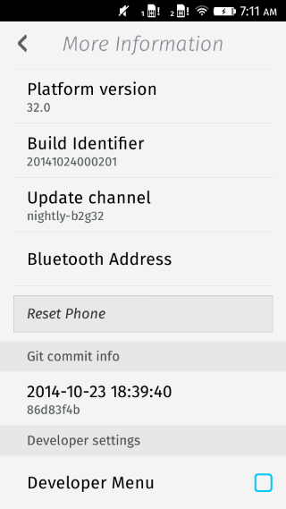
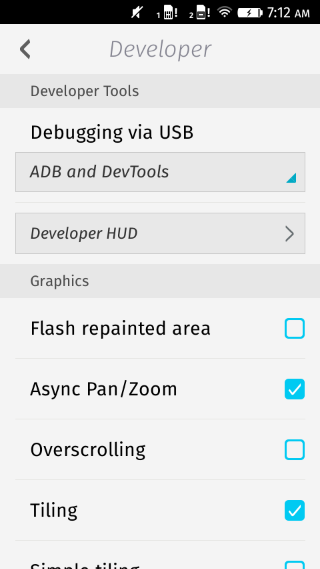
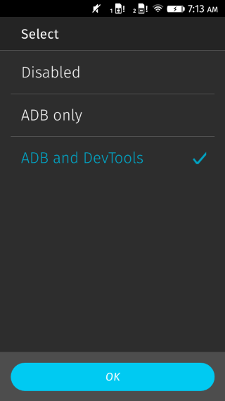

# So I got a Flame. Now What?

## On your computer

1. First, [get Firefox](https://www.mozilla.org/en-US/firefox/new/)
  * Already have it? Awesome! Make sure it's up to date. The current version is 33.

2. Open Firefox

3. Next, enable the WebIDE:
  * Click on the 'Tools' menu
  * Click on 'Web Developer'
  * Click 'Developer Toolbar'
  * In the Developer Toolbar, type `pref set devtools.webide.enabled true`, then press Enter.

4. Open the WebIDE
  * Click on the 'Tools' menu
  * Click on 'Web Developer'
  * Click 'WebIDE'

5. Install the ADB Helper
	* In the top right corner of the WebIDE, click 'Select Runtime'
  * Under 'Devices', select 'Install ADB Helper'
    * The process should now begin- if there are network problems let someone know and they can assist you.

## On your Flame device

1. Enable the Developer Menu:

  * Open up the Settings app

    

  * Click on 'Device Information'

    

  * Click on 'More Information' (I know, right?)

    

  * Scroll to the very bottom.
  * Check the item labeled 'Enable Developer Menu'

    

2. Go to the top menu of the Settings app

  * Scroll to the bottom and open the Developer menu

    

  * Click the menu item 'Debugging and USB'

    

  * Select 'ADB and DevTools'

    

## Connect your Flame to your Computer

1. Using your favorite micro-USB cable, connect your Flame to your computer's USB port

2. Open Firefox

3. Open the WebIDE

  * Click on the 'Tools' menu
  * Click on the 'Web Developer' item
  * Click 'WebIDE'

4.
